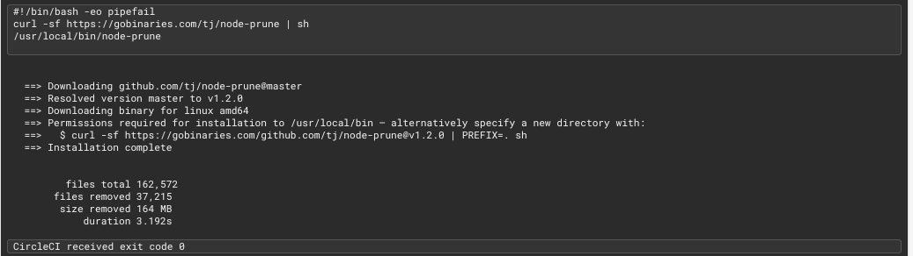

# Accelerate CircleCI Build Time for the Monorepo

- [Introduction](#introduction)
- [Useful Techniques](#useful-techniques)
    - [Change Detection](#Change-detection)
    - [Selectively persisting to workspaces](#Selectively-persisting-to-workspaces)
    - [Prune node_modules](#Prune-node_modules)
    - [Use next-generation convenience Docker images](#Use-next-generation-convenience-Docker-images)
    - [Docker RAM Disk](#Docker-RAM-disk)
- [Improvement Result](#improvement-result)
- [Supplementary Information](#supplementary-information)
    - [Directory structure on running CircleCI docker](#directory-structure-on-running-circleci-docker)
    - [Create a new package](#create-a-new-package)
- [Reference](#reference)


## Introduction
Monorepo is a hot topic for a discussion. There have been many articles about why you should or should not use this type of software development strategy, but ignore the complexity of continuous integration (CI) from the DevOps team's perspective.

It has been a headache problem for the monorepo with several applications. Even the small change on one of the applications, it also triggers whole CI process and builds other irrelative stuff on that repository, which wastes the computer resource and the developer's time to wait for CI completion. The first technique to deal with this kind of problem is to detect the changes and only triggers the affected CI application workflow. Cooperating with other techniques, it can efficiently accelerate CI completion time.

---

## Useful Techniques
### Change detection
By convention, each application is located in the `packages` directory and has its own CI workflow defined in the `workflows` section in `.circleci/config.yml`

Whenever a small change is merged to the master branch, the `main` workflow is triggered in CircleCI. The `main` workflow consists of a single job called `Determine Workflows`, which executes the `circle_trigger.sh` bash script. It is responsible for detecting which application having code changes and triggers the corresponding workflow via CircleCI API 

Each workflow is conditioned using a `when` clause, that depends on a pipeline parameter to trigger it. The name of the parameter is the same as the name of the application.

The following will explain the logic of how `circle_trigger.sh` script detects the code changes:

- Find the commit hash of the last completed CI pipeline
  - Check whether the current pipeline exists or not
  - Attempt to get the last completed CI pipeline ID and find its commit hash on the current branch
  - If there is no CI pipeline on the current branch, then it uses the commit hash of last pipeline on the master branch

- Find out the code changes 
  - Once it has the commit hash of the last CI pipeline, it uses `git log` to list all changes between the two commits and flag those applications for which changes are found in their directories.
- Trigger the corresponding application via CircleCI API

>  To use the CircleCI API, you will need API tokens with the appropriate permissions. This document describes the steps of creating a personal API token. 
https://circleci.com/docs/2.0/managing-api-tokens/#creating-a-personal-api-token

> It is advised that don't directly code the API token to git. You should use project environment variables
https://circleci.com/docs/2.0/env-vars/#setting-an-environment-variable-in-a-project

### Selectively persisting to workspaces
CircleCI provides several methods of persisting data in workflows. It is great to know the differences between workspace and cache and select the right method for the right task, which will help to accelerate the CI build time.

**Workspace**


Source: [Persisting Data in Workflows: When to Use Caching, Artifacts, and Workspaces](https://circleci.com/blog/persisting-data-in-workflows-when-to-use-caching-artifacts-and-workspaces/)

Workspaces persist data between job in a `single` workflow. The downstream job can use the workspace saved by the upstream job for its own needs. When the whole workflow is completed, that workspace will be dismissed and no longer pass to another workflow. In other words, `workspace move data in between sequential jobs in a workflow`

**Cache**


Source: [Persisting Data in Workflows: When to Use Caching, Artifacts, and Workspaces](https://circleci.com/blog/persisting-data-in-workflows-when-to-use-caching-artifacts-and-workspaces/)

Caching is more powerful than `workspace`, as is global data sharing within a project. After the initial job run, it makes the other subsequent jobs faster by reusing the data from previous jobs. We intensively it use with `package dependency managers` i.e. Yarn. With dependencies restored from a cache, command like `yarn install` will only need to download new dependencies and not downloaded everything on every build.

In other words, `caching persist data between the same job in multiple workflow runs`


Some community developers complain [slow in the job of "restoring cache"](https://discuss.circleci.com/t/slow-restoring-source-cache-30s-sometimes-2m/4653) and our team also have experience in long waiting time for restoring cache. One of the extreme case took 5 minutes 34 seconds to complete running.


It is good idea to reduce the occurrence of `restore_cache` , which also is replaced with `persist_to_workspace`. After the specific workflow triggered by the previous step `change detection`, only its first job `setup` will use `restore_cache` to retrive necessary data from CircleCI S3 bucket and save into workspace.
``` yaml
setup:
  parameters:
    presetup:
      description: "Steps that will be before setup"
      type: steps
      default: []
    postsetup:
      description: "Steps that will be executed after successful setup"
      type: steps
      default: []
  executor: node_executor
  resource_class: medium
  steps:
    - checkout
    - steps: << parameters.presetup >>
    - *restore_yarn_cache
    - *run_yarn
    - modclean
    - *save_yarn_cache
    - steps: << parameters.postsetup >>
    - *persist_repo_workspace
```
The rest of downstream jobs will resuse these data from workspace by the alias `*attach_repo_workspace` , for example `build` job
``` yaml
build:
  parameters:
    web_app_name:
      description: "Name of the Web App"
      type: string
    prebuild:
      description: "Steps that will be executed after dependencies are installed, but before the build begins"
      type: steps
      default: []
    postbuild:
      description: "Steps that will be executed after successful build"
      type: steps
      default: []
  executor: node_executor
  steps:
    - *attach_repo_workspace
    - steps: << parameters.prebuild >>
    - run:
        name: Build << parameters.web_app_name >>
        command: |
          yarn build:lib
          yarn workspace @sunny/<< parameters.web_app_name >> build
    - steps: << parameters.postbuild >>
    - *persist_build_workspace
```

### Prune node_modules
When you set up a new monorepo, you install all of the required npm packages and are placed in `node_modules` automatically. Then you take a look at its size and discover that the heaviest object in the universe is `node_modules`. It is better to use a utility that finds and removes unnecessary files and folders from `node_modules`.


Compared with three existing tools including [node-prune](https://github.com/tj/node-prune), [modclean](https://www.npmjs.com/package/modclean) and [yarn autoclean](https://classic.yarnpkg.com/en/docs/cli/autoclean/), the following lists out the pro and con of each tool.

**node-prune**

- Pro: Quick process time (around 3-4 seconds)

- Con: Only have a few customized options, which can't ignore some files we don't want to remove. It causes that most Ci jobs got failed.

  

**modclean**

- Pro: More flexible in fine-tuning deleting file preference
- Con: Take around (10 - 20 seconds) to complete the pruning process


**Yarn Autoclean**

- Con: slow and low-efficiency

Finally, we chose the `modclean`, as it provides more customization to us, such as whitelist / blacklist some node file.

``` yaml
modclean:
  steps:
    - run:
        name: Prune node module
        command: |
          npx modclean -r --ignore="makefile*"
```

``` yaml
setup:
  parameters:
    presetup:
      description: "Steps that will be before setup"
      type: steps
      default: []
    postsetup:
      description: "Steps that will be executed after successful setup"
      type: steps
      default: []
  executor: node_executor
  resource_class: medium
  steps:
    - checkout
    - steps: << parameters.presetup >>
    - *restore_yarn_cache
    - *run_yarn
    - modclean
    - *save_yarn_cache
    - steps: << parameters.postsetup >>
    - *persist_repo_workspace

```


### Use next-generation convenience Docker images

The step of "Spin up environment" is responsible for creating the virtual environment e.g. docker or Ubuntu virtual machine in which your job will be executed. CircleCI launches the [pre-built CircleCi images](#https://circleci.com/docs/2.0/circleci-images/#next-generation-convenience-images) that will generally have fewer and similar layers. Using these new images will lead to faster image downloads when a build starts, and a higher likelihood that the image is already cached on the host 

This is a direct replacement for the legacy CircleCI Node image (circle/node) with cimg-based repository (cimg/node).

Before use next-generation docker image
``` yaml
  executors:
   node_executor:
    docker:
     - image: circleci/node:latest-browsers
    working_directory: ~/repo
```
After use next-generation docker image
``` yaml
  executors:
   node_executor:
    docker:
     - image: cimg/node:12.16
    working_directory: /mnt/ramdisk/repo
```


Based on the scenario of no cache on the host, it takes less around 34 seconds to spin up the new docker compared with adopting legacy CircleCI images. 

**Before**


**After**


But why has this improvement? Because the new image are all built from the same base image, which can cache very well using [Docker Layer Caching](https://circleci.com/blog/how-to-build-a-docker-image-on-circleci-2-0/)

### Docker RAM disk

As mentioned before, the CircleCI users complained slow cache restores. In this experiment, i decided to explore what might be causing this. CircleCI uploads and download cache by compressing tar file into AWS S3. When the user requests a cache, CircleCI executor retrieve the tar file from S3 and unzip it. 

According to [CircleCI employee's](https://discuss.circleci.com/t/slow-restoring-source-cache-30s-sometimes-2m/4653/19) opinions, the root cause of slow cache restores is the slow connection to S3, whose bottleneck is network side problem. But it is only one of the possible reasons. After unzip node_modules may have a lot of files and folders, disk IO also can slow down the performance. As the CircleCI docker executor is hosted on an underlying AWS EC2 VM. As a consequence, other containers also consume and share a local SSD. Leveraging a RAM disk avoids writing the file to the SSD at all. Based on CircleCI official document, a  RAM disk is available at `/mnt/ramdisk` that offers a temporary file storage paradigm, similar to using /dev/shm.

The simplest way to use the RAM disk is to configure the `work_directory` of a job to be ``/mnt/ramdisk`. 

> Need to change cache key version after using RAM disk

``` yaml
executors:
  node_executor:
    docker:
      - image: cimg/node:12.16
    working_directory: /mnt/ramdisk/repo
```
``` yaml
- &persist_repo_workspace
  persist_to_workspace:
    root: /mnt/ramdisk/repo
    paths:
      - ./*
- &attach_repo_workspace
  attach_workspace: { at: /mnt/ramdisk/repo }

```


## Improvement Result

---
## Supplementary Information

### Directory structure on running CircleCI docker
```sh
/mnt/ramdisk                # RAM Disks - Temporary File Storage Paradigm
├── .cache                  # Default yarn's global cache
    ├── yarn                # Include in save_yarn_cache alias                
└── repo                    # Checkout bowtie-web code and include in persist_repo_workspac 
    ├── app
      ├── node_modules      # Include in save_yarn_cache alias 
      ├── build             # Include in persist_build_workspace alias
    ├── ...
    ├── ...
    └── node_modules        # Include in save_yarn_cache alias   
```
### Create a new package
Once you add a new application / component to this monorepo you have to do the following steps:

Assume that the name of new application is `abc`

- Create a folder named `abc` on `packages` directory. The name of the directory will be used as the name of service / component later

- In `.circleci/config.yml` configuration file, add a corresponding parameter in `parameters` section
``` YAML
  abc: # this should be the name of your service
    type: boolean
    default: false
```

## Reference
- [Github -labs42io/circleci-monorepo](#https://github.com/labs42io/circleci-monorepo)
- [Accelerate your deploys with these 5 CircleCI optimizations](https://transcend.io/blog/accelerate-your-deploys-with-these-5-circleci-optimizations)
- [CircleCI Performance Difference Between Cache and Workspace](https://hackernoon.com/circleci-performance-difference-between-cache-and-workspace-5567679c3601)

