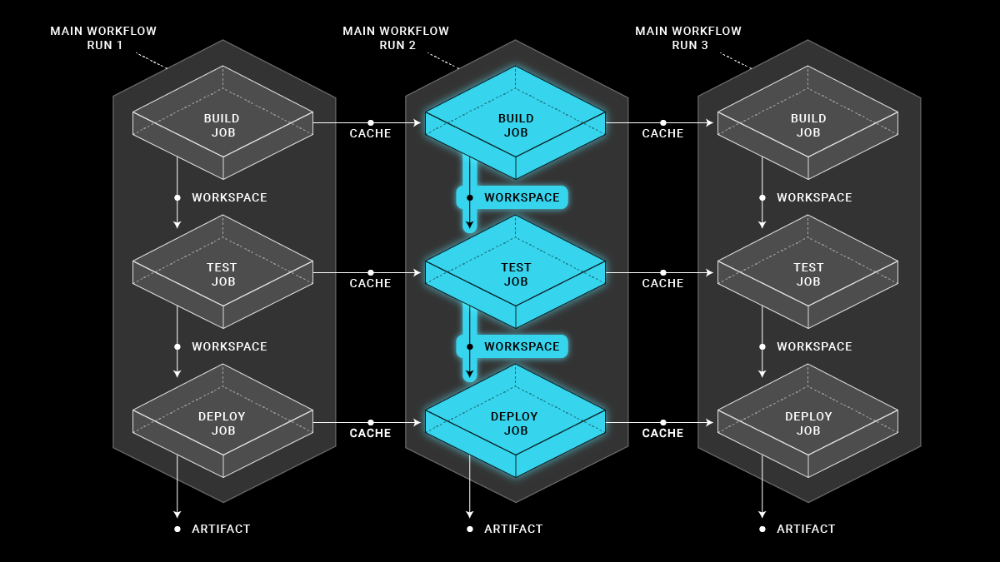
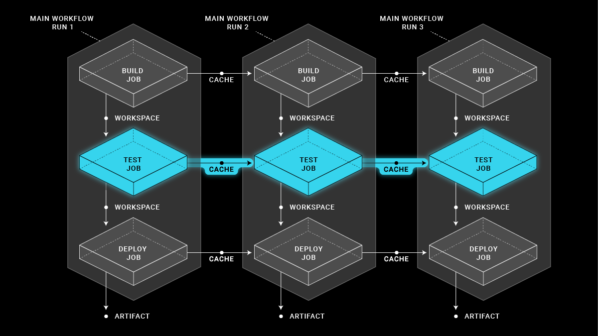
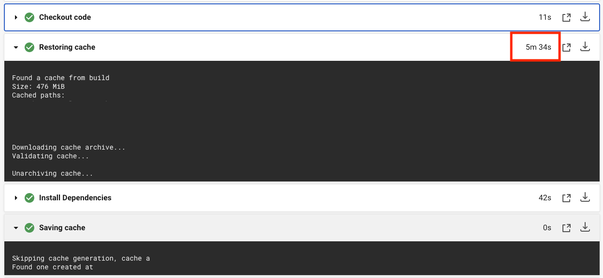
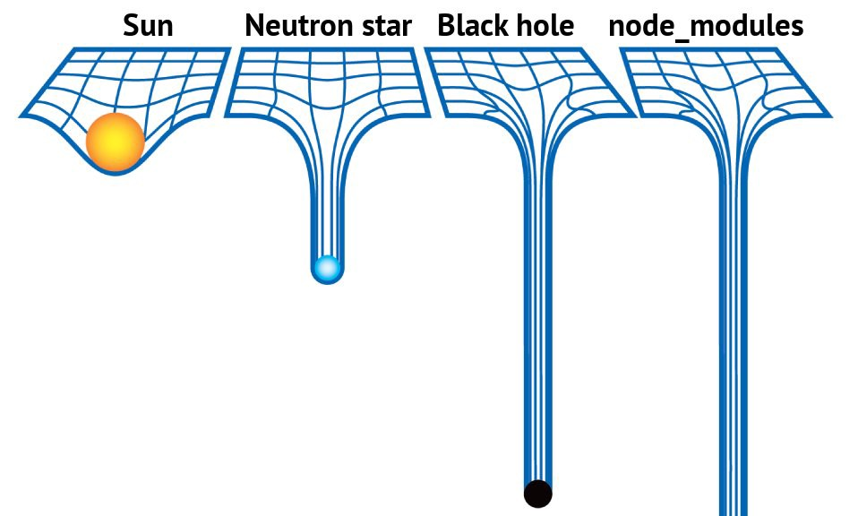
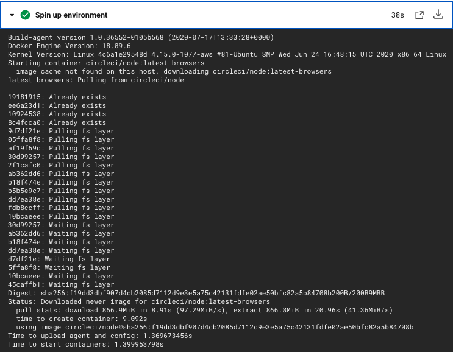
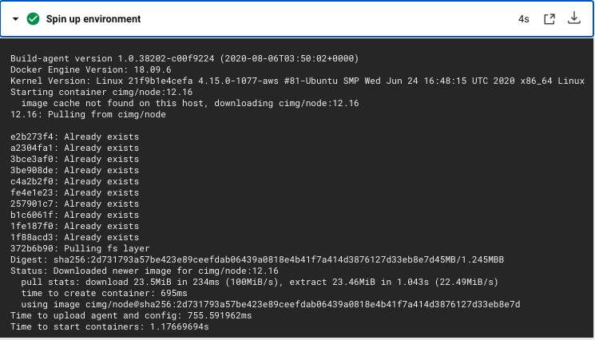

# Accelerate CircleCI Build Time for the Monorepo

- [Introduction](#introduction)
- [Useful Techniques](#useful-techniques)
    - Change Detection[#change-dectection]
    - Migrate from a cache to a workspace
    - Prune node_modules
    - Docker RAM Disk
    - [Improvement Result](#improvement-result)
- [Supplementary Information](#supplementary-information)
    - [Directory structure on running CircleCI docker](#directory-structure-on-running-circleci-docker)
    - [Create a new package](#create-a-new-package)
- [Reference](#reference)


## Introduction
Monorepo is a hot topic for a disscussion. There have been many articles about why you should or should not use this type of software development strategy, but ignore the complexity of continuous integration (CI) from DevOps team's perspective.

It has been a headache problem for the monorepo with several applications. Even the small change on one of the applications, it also triggers whole CI process and builds other irrelative stuff on that repository, which definitely wastes the computer resource and the developer's time to wait for CI completion. The first technique to deal with this kind of problem is to detect the changes and only triggers the affected CI application workflow. 

---

## Useful Techniques
### Change detection
By convention, each application is located in the `packages` directory and has its own CI workflow defined in the `workflows` section in `.circleci/config.yml`

Whenever creating a pull request, merging the master branch, and releasing a tag, the `main` workflow is triggered in CircleCI. The `main` workflow consists of a single job called `Determine Workflows`, which executes the `circle_trigger.sh` bash script. It is responsible for detecting which application having code changes and triggers the corresponding workflow via CircleCI API 

Each workflow is conditioned using a `when` clause, that depends on a pipeline parameter to trigger it. The name of the parameter is the same as the name of the application.

The following will explain the logic of how `circle_trigger.sh` script detects the code changes:

- Find the commit hash of last completed CI pipeline
  - Check whether the current pipeline exists or not
  - Attempt to get the last completed CI pipeline ID and find its commit hash on the current branch
  - If there are no CI pipeline on the current branch, then it uses the commit hash of last pipeline on master branch

- Find out the code changes 
  - Once it has the commit hash of last CI pipeline, it uses `git log` to list all changes between the two commits and flag those applications for which changes are found in their directories.
- Trigger the corresponding application via CircleCI API


### Selectively persisting to workspaces
CircleCI provides several methods of persisting data in workflows. It is great to know the differences between workspace and cache and select the right method for the right task, which will help to accelate the CI build time.

**Workspace**


Source: [Persisting Data in Workflows: When to Use Caching, Artifacts, and Workspaces](https://circleci.com/blog/persisting-data-in-workflows-when-to-use-caching-artifacts-and-workspaces/)

Workspaces persist data between job in a `single` workflow. The downstream job can use the workspace saved by the upstream job for its own needs. When the workflow completed, that workspace will be dismissed and no longer pass to another workflow. In other words, `workspace move data in between sequential jobs in a workflow`

**Cache**



Source: [Persisting Data in Workflows: When to Use Caching, Artifacts, and Workspaces](https://circleci.com/blog/persisting-data-in-workflows-when-to-use-caching-artifacts-and-workspaces/)

Caching is more powerful than `workspace`, as is global data sharing within a project. After the initial job run, it makes the other subsequent jobs faster by reusing the data from previous jobs. We intensively use with `package dependency managers` i.e. Yarn. With dependencies restored from a cache, command like `yarn install` will only need to download new dependencies and not downloaded everything on every build.

In other words, `caching persist data between the same job in multiple workflow runs`


Some community developers complaint [slow in the job of "restoring cache"](https://discuss.circleci.com/t/slow-restoring-source-cache-30s-sometimes-2m/4653) and our team also have experience in long waiting time for restoring cache. One of extreme cases took 5 minutes 34 seconds to complete running.



It is good idea to reduce the occurrence of `restore_cache` , which also is replaced with `persist_to_workspace`. After the specific workflow triggered by the previous step `change detection`, only its first job `setup` will use `restore_cache` to retrive necessary data from CircleCI S3 bucket and save into workspace. The rest of downstream jobs will resuse these data from workspace.

### Prune node_modules

Monorepo consists of a lot of nodejs packages 





### Use next-generation convenience Docker images

The step of "Spin up environment" is responsible for creating the virutal environment e.g. docker or Ubuntu virutal machine in which your job will be executed. CircleCI lauches the [pre-built CircleCi images](#https://circleci.com/docs/2.0/circleci-images/#next-generation-convenience-images) that will generally have fewer and similar layers. Using these new images will lead to faster image downloads when a build starts, and a higher likelihood that the image is already cached on the host 


``` yaml

```

This is a direct replacement for the legacy CircleCI Node image (circle/node) with cimg-based repository (cimg/node).

Based on the scenario of no cache on the host, it takes less around 34 seconds to spin up the new docker compared with adopting legacy CircleCI images. But why has this improvement? 

**Before**



**After**



### Docker RAM disk

According to [CircleCI employee's](https://discuss.circleci.com/t/slow-restoring-source-cache-30s-sometimes-2m/4653/19) opinions, in


### Improvement Result

---
## Supplementary Information

### Directory structure on running CircleCI docker
```sh
/mnt/ramdisk                # RAM Disks - Temporary File Storage Paradigm
├── .cache                  # Default yarn's global cache
    ├── yarn                # Include in save_yarn_cache alias                
└── repo                    # Checkout bowtie-web code and include in persist_repo_workspac 
    ├── app
      ├── node_modules      # Include in save_yarn_cache alias 
      ├── build             # Include in persist_build_workspace alias
    ├── ...
    ├── ...
    └── node_modules        # Include in save_yarn_cache alias   
```
### Create a new package
Once you add a new application / component to this monorepo you have to do the following steps:

Assume that the name of new application is `abc`

- Create a folder named `abc` on `packages` directory. The name of the directory will be used as the name of service / component later

- In `.circleci/config.yml` configuration file, add a corresponding parameter in `parameters` section
``` YAML
  abc: # this should be the name of your service
    type: boolean
    default: false
```

## Reference
- [Github -labs42io/circleci-monorepo](#https://github.com/labs42io/circleci-monorepo)
- [Accelerate your deploys with these 5 CircleCI optimizations](https://transcend.io/blog/accelerate-your-deploys-with-these-5-circleci-optimizations)
- [CircleCI Performance Difference Between Cache and Workspace](https://hackernoon.com/circleci-performance-difference-between-cache-and-workspace-5567679c3601)

